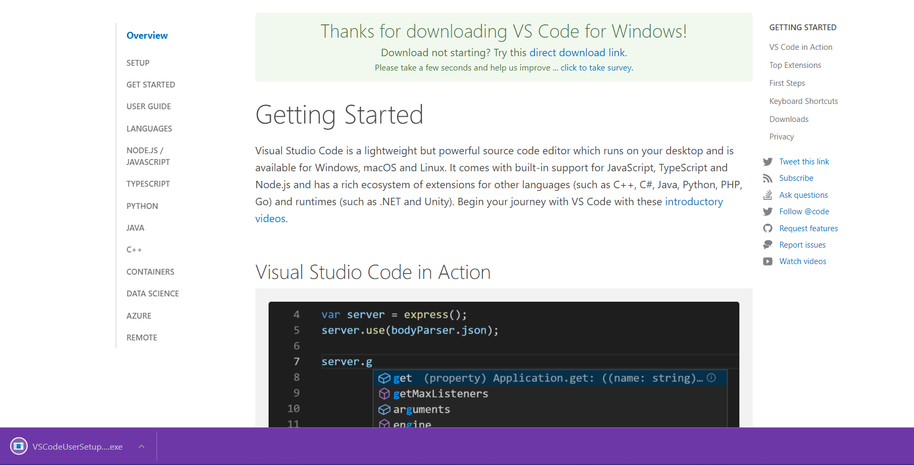
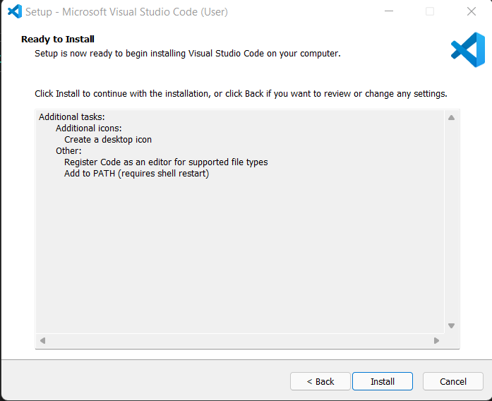
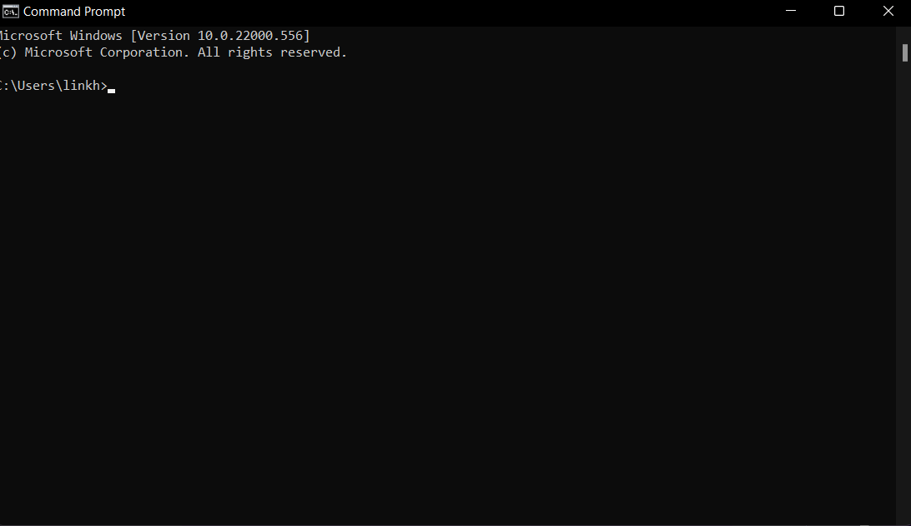
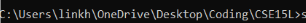

[Back to main page](https://lykevin2341.github.io/cse15l-lab-reports/index.html)

[Back to lab reports](https://lykevin2341.github.io/cse15l-lab-reports/LabReports.html)
# Downloading and setting up VSCode
Step 1. Go online and download the installer for VSCode.


Step 2. You should see the file installed at the bottom of your screen if you are using Chrome. The download location on screen differes based on the browser.



Step 3. Run the installer and let it finish.



Step 4. After it installs it should look something like this. (Ignore the color scheme, that is just the scheme I chose for myself.)


# Remotely Connecting
Step 1. Open up the terminal (CMD if you are on Windows, or you can use the VSCode terminal)



Step 2. Log in using the command `ssh cs15lsp22xxx@ieng6.ucsd.edu` (xxx is the 3 letters corresponding to your specific username)


Step 3. Put in your password as prompted in the image above and hit enter. (It won't show the password typing. **Don't Freak out**, it is just for security reasons, just type it normally and it should work)

Step 4. After that everything should work and you should be logged in, and see something similar to this.


# Running Commands
Here are a list of some useful commands you can use.


The steps to run the commands are simple, just type the command as seen, and if the command asks for the directory, use the directory specific to what you want to do.

>Here are some test commands

`cd ~ (In Windows)`


It seems to not be a working command in windows because there is no home directory named `~`


`cd ~ (In SSH)`


It works in ssh since it is unix based and returns to the home directory


`ls (In Windows)`


In Windows it seems that ls is not a functioning command.


`ls (In SSH)`


In SSH it lists all the contents of that directory that you are currently in.


# Moving Files Using SCP
Step 1. Make sure you are in the directory that the file is located in. If you aren't you can use `cd` then the name of the folders until you reach that directory. `Cd` moves you to a directory that you give the name of. For me I had to cd a few times to reach my cse15L folder



Step 2. Write the command in your standard terminal before logging into the `SSH` by doing `scp (*file name*) cs15lsp22xxx@ieng6.ucsd.edu:~/` (xxx being the 3 letters corresponding to youse username) (The `~/` is the home directory we are copying it to, but you can put whatever location you want there)


Step 3. It will then ask for your password to your account, type that in like you would when logging in to your `SSH` and the file transfer should look like this.


Step 4. Now just log in and run the command `ls` to list all the contents of your current file directory, and it should show the file. (The screenshot will show the full process if you want to see the whole process)


# Setting an SSH Key (For Windows because that's what I use)
(Sorry this was the only screenshot I had available, I didn't want to run the key authorization process again and accidentally mess mine up since I already had it set)

Step 1. Run this command `ssh-keygen -t ed25519` in your terminal (It is going to ask for a passphrase, just leave that blank the two times it asks so that you can log in without any password) (You will also told where your key and public key are being stored)

Step 2. Now keep in mind where the public key is stored and run these commands in order

```
ssh cs15lsp22xxx@ieng6.ucsd.edu (xxx being your corresponding letters to your username)

(Enter your password)

#now on server

mkdir .ssh

logout/exit

#back on client
scp (public key path) (This last one you do based on the file path of the public key)
```

Step 3. These commands should have set the authorized key and now allows you to run `scp` and `ssh` without entering a password.


(As you can see, I was logged in without a password ever being asked for)

# Optimizing Remote Running
* I have saved the ssh command with my username to the up arrow key so that I can use 1 to 2 key strokes to get to it. (This will be seamless as the log in will be almost instant because of the key we set to log in for us)


* I also have the `scp` function saved to the up arrow key which will stream line the process by lowering the key strokes needed 

* We can also use the log in command couples with another command that we want to run after the log in by using `""` around the command such as 
* `ssh cs15lsp22xxx@ieng6.ucsd.edu "ls"`


