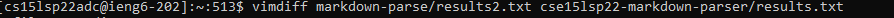

[Back to main page](https://lykevin2341.github.io/cse15l-lab-reports/index.html)

[Back to lab reports](https://lykevin2341.github.io/cse15l-lab-reports/LabReports.html)

# Week 10 Lab Report 5

## I. How I Found the Differences

Step 1. First I `ran bash script.sh` in the `cse15lsp22-markdown-parser` repository and got the output.

Step 2. Second I used output redirection (`bash script.sh > results.txt`) to move the output of the command to a text file named `results.txt`

Step 3. Next I copied over the `test-files.md` file from the `cse15lsp22` repository to my personal `markdown-parse` using the command `scp -r cse15lsp22-markdown-parser/test-files markdown-parser/` and also used `scp -r cse15lsp22-markdown-parser/script.sh markdown-parser/` to copy the script.sh file to my personal `markdown-parse`

Step 4. Fourth I repeated the same steps from step 1 and 2 but in my personal `markdown-parse` repository instead. The only change was that I named the output file `results2.txt`.

Step 5. Finally I used the command `vimdiff markdown-parser/results2.txt cse15lsp22-markdown-parser/results.txt` to show the  differences in results between the two text files using vim.

## II. Comparing Tests

**File 1.** https://github.com/nidhidhamnani/markdown-parser/blob/main/test-files/201.md

* For this test my `markdown-parse` was incorrect and had the wrong output, while the `cse15lsp22 markdown-parse` was correct for test file 201.md
* This was the expected output using the preview option in VSCode provided to us, though the preview says foo, when hovered over, the link is baz.

* And this was the output from my `markdown-parse` (on the left) and the `cse15lsp22` one (on the right)

*Location of possible error in code (image below)

* For my `markdown-parse` it seems that the reason my code isn't working is because of the ":" and space between teh end bracket and the opening parenthesis, it seems to not be able to tell that there is still a parenthesis after, and so it just outputs out failure statement about having valid url's. Something I think I can do is to change the condition of my if statement that checks whether there is an open or closed bracket, it seesm to assume they will conme directly after each other. This could be what is causing the code to output the error message instead of printing baz.

**File 2.** https://github.com/nidhidhamnani/markdown-parser/blob/main/test-files/41.md

* For this test, my `markdown-parse` was incorrect as well as the `cse15lsp22 markdown-parser` as well. Both had the incorrect output for the file
* This was the expected output using the preview option in VSCode provided to us, though the preview say a, when hovered over, the link is "tit"

